# 机器学习概况

```
【数据层】
├── 张量 Tensor（多维数组：0维标量→1维向量→2维矩阵→3D+张量）
├── 特征 Feature（输入属性）
└── 标签 Label（预测目标，监督学习用）

【模型层（神经网络）】
├── 神经元 Neuron（最小单元：输入 × 权重 + 偏置 → 激活）
│   ├── 权重 Weight（可学习，决定特征重要性）
│   ├── 偏置 Bias（偏移量，提升灵活性）
│   └── 激活函数 Activation（引入非线性）
│       ├── ReLU（最常用）
│       ├── Sigmoid（二分类）
│       └── Softmax（多分类）
└── 层 Layer
    ├── 输入层
    ├── 隐藏层（提取特征）
    └── 输出层（预测结果）

【训练层】
├── 损失函数 Loss（衡量预测误差）
│   ├── 分类：交叉熵
│   └── 回归：MSE
├── 梯度下降 GD（沿损失下降方向更新）
├── 优化器 Optimizer（更新权重）
│   ├── SGD
│   └── Adam（主流）
├── 过拟合 Overfitting（训练好、测试差）
└── 欠拟合 Underfitting（都不好）

【任务层】
├── 监督学习（有标签）
│   ├── 分类（猫/狗）
│   └── 回归（预测价格）
├── 无监督学习（无标签）
│   ├── 聚类
│   └── 降维
└── 强化学习（奖励驱动）

【模型架构（进阶）】
├── CNN（图像）
├── RNN/LSTM（序列）
└── Transformer（文本/大模型）
```

# 语言模型基础

## 条件概率

条件概率是“在已知事件B已经发生的前提下，事件A发生的概率”，记作P(A|B)，公式是P(A|B)=P(A∩B)/P(B)

```
示例：
例如一副52张牌中已知抽到的是红牌（26张），再问它是红桃（13张）的概率就是P(红桃|红牌)=13/26=1/2
```

## N-gram（N元语法模型）

* 统计学思想，计算词对的概率
* 其核心思想是，一个【句子】出现的概率，等于该句子中【每个词】出现的条件概率的连乘。
* 【马尔科夫假设】：我们不必回溯一个词的全部历史，可以近似地认为，一个词的出现概率只与它前面有限的n- 1个词有关。
    * P(w_t|w_1,...,w_{t-1})≈P(w_t|w_{t-N+1},...,w_{t-1})
    * 这些概率可以通过在大型语料库中进行最大似然估计(Maximum Likelihood Estimation,MLE) 来计算

```
N-gram是把文本按顺序切成长度为 N 的连续片段（可以是字、词或子词）的方法：1-gram是单个单位，2-gram是相邻两个，3-gram是相邻三个。
常用于语言模型、分词、文本分类。

示例：
“我 爱 自然 语言 处理”的 2-gram 是 “我爱、爱自然、自然语言、语言处理”
```

缺点：

* 数据稀疏性 (Sparsity) ：如果一个词序列从未在语料库中出现，其概率估计就为 0
* 泛化能力差：模型无法理解词与词之间的语义相似性。比如：agent learns，robot learns

### MLE

最大似然估计(Maximum Likelihood Estimation,MLE)  
其思想非常直观：最可能出现的，就是我们在数据中看到次数最多的

```
对于 Bigram 模型，我们想计算在词 w_{i-1} 出现后，下一个词 是 w_i 的概率
P(w_i|w_{i-1}) = Count(w_{i-1},w_i) / Count(w_{i-1})
其中
  Count(w_{i-1},w_i)表示【相邻词对】(w_{i-1},w_i)在语料中的出现次数
  Count(w_{i-1})表示词w_{i-1}的出现次数
```

## 前馈神经网络（FFN）与 词嵌入

前馈神经网络（Feed-Forward Neural Network），用于根据上下文单词预测下一个单词。

其核心思想：

* 构建一个语义空间  
  创建一个高维的连续向量空间，然后将【词汇表中的每个词】都映射为该空间中的一个【点】。这个点（即向量）就被称为词嵌入 (Word
  Embedding) 或词向量。
  在这个空间里，语义上相近的词，它们对应的向量在空间中的位置也相近。

* 学习从上下文到下一个词的映射
  利用神经网络的强大拟合能力，来学习一个函数。这个函数的输入是前 n - 1 个词的词向量，输出是词汇表中【每个词】在当前上下文后出现的概率分布
  

```
整体结构
这是一个前馈神经网络，用于根据上下文单词预测下一个单词。

1. 输入层（Input Layer）
(1)输入是 X = A^[0]，表示上下文窗口中的单词
(2)W_(t-n+1) 到 W_(t-1)：表示从 t-n+1 到 t-1 时刻的单词（即当前时刻 t 之前的 n-1 个单词）
(3)这些单词会被转换成词向量（embedding）作为网络输入

2. 隐藏层（Hidden Layer）
图中有 3 个隐藏层：
第 1 隐藏层 A^[1]：包含神经元 a^[1]_1, a^[1]_2, ..., a^[1]_n
第 2 隐藏层 A^[2]：包含神经元 a^[2]_1, a^[2]_2, ..., a^[2]_n
第 3 隐藏层 A^[3]：包含神经元 a^[3]_1, a^[3]_2, ..., a^[3]_n
每层之间都是全连接的（可以看到密集的连线），意味着前一层的每个神经元都连接到下一层的所有神经元。

3. 输出层（Output Layer）
经过隐藏层处理后，数据传递到输出层 A^[4]
通过 Softmax 激活函数，将输出转换为概率分布
最终输出 Ŷ（预测值），即预测的下一个单词 W_t

工作原理
输入：给定前面的 n-1 个单词作为上下文
前向传播：数据从输入层依次经过各隐藏层
特征提取：每个隐藏层学习不同层次的语言特征
输出预测：Softmax 层输出词汇表中每个单词的概率
选择结果：选择概率最高的单词作为预测结果 W_t

数学表示
a^[l]_i 表示第 l 层的第 i 个神经元的激活值

每层的计算：A^[l] = f(W^[l] · A^[l-1] + b^[l])
其中 f 是激活函数（如 ReLU、tanh 等）
W^[l] 是权重矩阵
b^[l] 是偏置

```

优点：
神经网络语言模型通过词嵌入，成功解决了 N-gram 模型的泛化能力差的问题。

缺点：

* 上下文窗口是固定的。它只能考虑固定数量的前文

## 循环神经网络 RNN

RNN（Recurrent Neural Network）是一种专门处理序列数据的神经网络，关键特点是具有记忆能力，能够记住之前的信息。
核心：为网络增加“记忆”能力


```

结构组成
1. 时间展开结构
图中展示的是 RNN 按时间步展开的形式，从左到右分别是：
t=0 时刻：输入 X₀，输出 h₀
t=1 时刻：输入 X₁，输出 h₁
t=2 时刻：输入 X₂，输出 h₂
...
t=t 时刻：输入 Xₜ，输出 h

2. RNN Cell（循环单元）
每个绿色矩形框都是一个相同的 RNN 细胞单元，这是 RNN 的核心：
（1）参数共享：所有时间步的 RNN Cell 使用相同的权重参数
（2）序列传递：每个 Cell 的输出会传递给下一个时间步

3. 输入序列（X）
X₀, X₁, X₂, ..., Xₜ 构成输入序列

每个 Xₜ 可以是：
单词的词向量（NLP 任务）
时间序列数据点
音频帧特征等

4. 隐藏状态（h）
h₀, h₁, h₂, ..., hₜ 是隐藏状态序列

hₜ 包含了两部分信息：
当前时刻的输入 Xₜ
之前所有时刻的历史信息（通过链式传递）

工作原理
单个 RNN Cell 的计算：hₜ = f(Wₓₕ · Xₜ + Wₕₕ · hₜ₋₁ + b)

其中：
Wₓₕ：输入到隐藏层的权重矩阵（x→h）
Wₕₕ：隐藏层到隐藏层的权重矩阵（这是 RNN 的关键，实现记忆功能）
hₜ₋₁：上一时刻的隐藏状态
f：激活函数（如 tanh 或 ReLU）
b：偏置

     hₜ₋₁          hₜ
      │            │
      ▼            ▼
   ┌─────┐      ┌─────┐
──▶│ RNN │─────▶│ RNN │──▶
   │Cell │      │Cell │
   └─────┘      └─────┘
      ▲            ▲
      │            │
     Xₜ₋₁         Xₜ

RNN Cell 内部：
hₜ = tanh(Wₓₕ·Xₜ + Wₕₕ·hₜ₋₁ + b)

```

缺点：

* 第 t 个时间步的计算，必须等待第 t−1 个时间步完成后才能开始。这意味着 RNN 无法进行大规模的并行计算，在处理长序列时效率低下

## LSTM

LSTM（长短期记忆网络）：解决长期依赖问题
加入有门控机制(遗忘门、输入门、输出门)

```
┌─────────────────────────────────────────────────────┐
│                  LSTM Cell 内部                      │
│                                                     │
│   Xₜ ──┬──────────────────────────────────┐        │
│        │                                  │        │
│   hₜ₁─┼──┬─────────────────────────────┐│        │
│        │  │                             ││        │
│        │  ▼                             ││        │
│        │ ─────────┐                    ││        │
│        ││ 遗忘门   │ fₜ = σ(Wf·[hₜ₋₁,Xₜ]+bf) │        │
│        │ ────┬────┘                    ││        │
│        │      │ ×                      ││        │
│        │      ▼                        ││        │
│        │   Cₜ₋₁ ─────────┐            ││        │
│        │                   │            ││        │
│        │  ┌─────────┐      │            ││        │
│        │  │ 输入门   │ iₜ = σ(Wi·[hₜ₋₁,Xₜ]+bi) │        │
│        │  └────┬────┘      │            ││        │
│        │       │           │            ││        │
│        │  ┌────────┐      │            ││        │
│        │  │ 候选状态 │ C̃ₜ = tanh(Wc·[hₜ₋₁,Xₜ]+bc)│        │
│        │  └────┬────┘      │            ││        │
│        │       │ ×         │            ││        │
│        │       ▼           ▼            ││        │
│        │       └─────⊕ ←───┘            ││        │
│        │              │                 ││        │
│        │              │ Cₜ              ││        │
│        │              ▼                 ││        │
│        │         ┌─────────┐            ││        │
│        │         │ 输出门   │ oₜ = σ(Wo·[hₜ₋₁,Xₜ]+bo)│        │
│        │         └────┬────┘            ││        │
│        │              │ ×               ││        │
│        │         ┌────┴────┐            ││        │
│        │         │  tanh   │            ││        │
│        │         └────┬────┘            ││        │
│        │              │                 ││        │
│        ▼              ▼                 ▼▼        │
│       hₜ              hₜ                Cₜ       │
└─────────────────────────────────────────────────────┘

图例：
σ = Sigmoid 激活函数
× = 逐元素乘法（Hadamard 积）
⊕ = 逐元素加法

# 遗忘门：决定丢弃多少旧信息
fₜ = σ(Wf · [hₜ₋₁, Xₜ] + bf)

# 输入门：决定更新多少新信息
iₜ = σ(Wi · [hₜ₋₁, Xₜ] + bi)

# 候选状态：新的候选记忆
C̃ₜ = tanh(Wc · [hₜ₋₁, Xₜ] + bc)

# 更新细胞状态
Cₜ = fₜ × Cₜ₋₁ + iₜ × C̃ₜ

# 输出门：决定输出多少信息
oₜ = σ(Wo · [hₜ₋₁, Xₜ] + bo)

# 更新隐藏状态
hₜ = oₜ × tanh(Cₜ)

```

### 为什么 LSTM 能解决长期依赖问题？

```
X₁ → X₂ → X₃ → ... → X₁₀₀
│    │    │           │
▼    ▼    ▼           ▼
h₁ → h₂ → h₃ → ... → h₁₀₀

问题：h₁₀₀ 很难记住 X₁ 的信息（梯度在反向传播时指数级衰减）


C₁ ──────────→ C₂ ──────────→ ... ──────────→ C₁₀₀
│  遗忘门控制   │  遗忘门控制                  │
▼             ▼                               ▼
h₁            h₂                              h₁₀₀

关键：细胞状态 C 像一条"高速公路"，信息可以直接传递
      遗忘门可以选择性地保留早期信息
```

# Transformer架构

Transformer在2017 年由谷歌团队提出。它【完全抛弃了循环结构】，转而完全依赖一种名为【注意力 (Attention)
】的机制来捕捉序列内的依赖关系，从而实现了真正意义上的并行计算。


```
整体结构
Transformer 采用了 Encoder-Decoder（编码器 - 解码器）架构：
左侧（Encoder）：处理输入序列
右侧（Decoder）：生成输出序列
N×：表示 Encoder 和 Decoder 都包含了 N 个相同的层堆叠而成（通常是 6 层）

数据流程
1️⃣ 输入阶段（底部）
Encoder 输入：
Inputs → Input Embedding → 位置编码 → Encoder

Input Embedding：将输入词转换为向量
Positional Encoding：添加位置信息（因为 Transformer 没有 RNN 的顺序概念）

Decoder 输入：
Outputs (shifted right) → Output Embedding → 位置编码 → Decoder
shifted right：解码器输入是向右移动的输出序列（训练时用真实标签，推理时用已生成的部分）

2️⃣ Encoder 部分（左侧 N×层）
每层包含两个子层：
① 多头自注意力层（Multi-Head Attention）
输入 → Multi-Head Attention → Add & Norm → 输出到下一层
         ↓
    自注意力机制：让每个词都能关注到句子中的所有词

② 前馈神经网络层（Feed Forward）
→ Add & Norm → Feed Forward → Add & Norm → 输出

Add & Norm = 残差连接（Add）+ 层归一化（Norm）
残差连接：Output = Sublayer(x) + x
层归一化：稳定训练

3️⃣ Decoder 部分（右侧 N×层）
每层包含三个子层：
① 掩码多头注意力层（Masked Multi-Head Attention）
→ Masked Multi-Head Attention → Add & Norm →
         ↓
    Masked：防止解码器看到未来的词（只能关注当前位置之前的词）

② 多头注意力层（Multi-Head Attention）
→ Multi-Head Attention → Add & Norm →
         ↓
    这里的输入有两个来源：
    - Query：来自 Decoder 上一层
    - Key/Value：来自 Encoder 的输出
    作用：让解码器关注输入序列的相关信息

③ 前馈神经网络层（Feed Forward）
→ Add & Norm → Feed Forward → Add & Norm →


4️ 输出阶段（顶部）
Decoder 输出 → Linear → Softmax → Output Probabilities

Linear：将 Decoder 输出【映射到词汇表维度】
Softmax：【转换为概率分布，选择概率最高的词作为输出】

关键设计思想
》并行化
完全抛弃 RNN 的序列结构，所有位置可以同时计算
比 RNN/LSTM 快得多

》自注意力机制
句子："The cat sat on the mat because it was tired"
自注意力让"it"能关注到"cat"，理解指代关系

》多头注意力
多次并行执行注意力机制
让模型能从不同角度理解词与词的关系

》残差连接
不让网络每一层只学习“怎么把输入变成输出”，而是让它去学习“输出和输入之间的差值是多少”

解决深层网络梯度消失问题
让信息可以直接传递到更深层

实际例子：翻译任务
输入："I love AI" → 输出："我爱人工智能"

1. Encoder 处理 "I love AI"
   - 自注意力让每个词理解整个句子的关系

2. Decoder 逐步生成：
   - 第 1 步：生成"我"（基于输入和起始符）
   - 第 2 步：生成"爱"（基于输入+"我"）
   - 第 3 步：生成"人工智能"（基于输入+"我爱"）
   
3. 每一步 Decoder 都通过注意力机制关注输入的相关部分

```

## 1.Encoder-Decoder 整体结构

* 位置编码（Positional Encoding）
* 编码器 (Encoder) ：任务是“理解”输入的整个句子。它会读取所有输入词元，最终为每个词元生成一个富含上下文信息的向量表示
* 解码器 (Decoder) ：解码器 (Decoder) ：任务是“生成”目标句子。它会参考自己已经生成的前文，并“咨询”编码器的理解结果，来生成下一个词。

## 2.自注意力到多头注意力


* 自注意力机制： 它允许模型在处理序列中的每一个词时，都能兼顾句子中的所有其他词，并为这些词分配不
  同的“注意力权重”。


* 多头注意力机制：它将原始的 Q, K, V 向量在维度上切分成 h 份（h 就是“头”数），每一份都独立地进行一次单头注意力的计算。这就好
  比让 h 个不同的“专家”从不同的角度去审视句子，每个专家都能捕捉到一种不同的特征关系。最后，将这 h 个专家的
  “意见”（即输出向量）拼接起来，再通过一个线性变换进行整合，就得到了最终的输出。

## 3.前馈神经网络FNN

* 如果说注意力层的作用是从整个序列中“动态地聚合”相关信息，那么前馈网络的作用从这些聚合后的信息中提取更高阶的特征。

## 4.残差连接与层归一化

* 残差连接 (Add)：该操作将子模块的输入 x 直接加到该子模块的输出 Sublayer(x) 上。这一结构解决了深度神经网络中的梯度消失 (
  Vanishing Gradients) 问题

* 层归一化 (Norm)：该操作对单个样本的所有特征进行归一化，使其均值为0，方差为1。这解决了模型训练过程中的内部协变量偏移 (
  Internal Covariate Shift) 问题，使每一层的输入分布保持稳定，从而加速模型收敛 并提高训练的稳定性。

# Transformer架构（AI By Hand）

参考资料：

- https://www.zhihu.com/question/596771388/answer/119375053579
- https://bbycroft.net/llm
- https://www.byhand.ai/

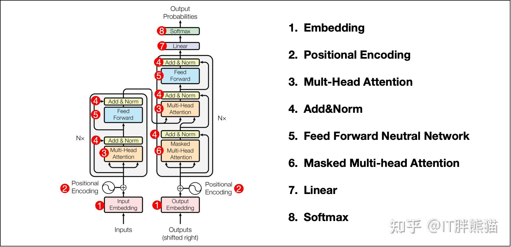

## 1.Embedding

Embedding 就是个翻译，让人工智能更容易理解你说的是什么

### 独热编码

大语言模型（如 DeepSeek）处理自然语言输入时的第一步：**独热编码（One-Hot Encoding）**的矩阵表示
它的主要作用是将人类能看懂的“文字”转换为计算机能处理的“数学矩阵”（行代表的是词表，列代表的是输入序列）
“独热（One-Hot）”——每一列（代表一个字）中，只有一个位置是“热”的（值为 1），其余都是“冷”的（值为 0）

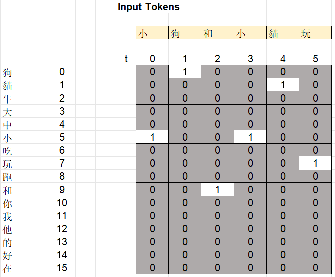

### 矩阵乘法

MMULT(Word embedding, one hot)**
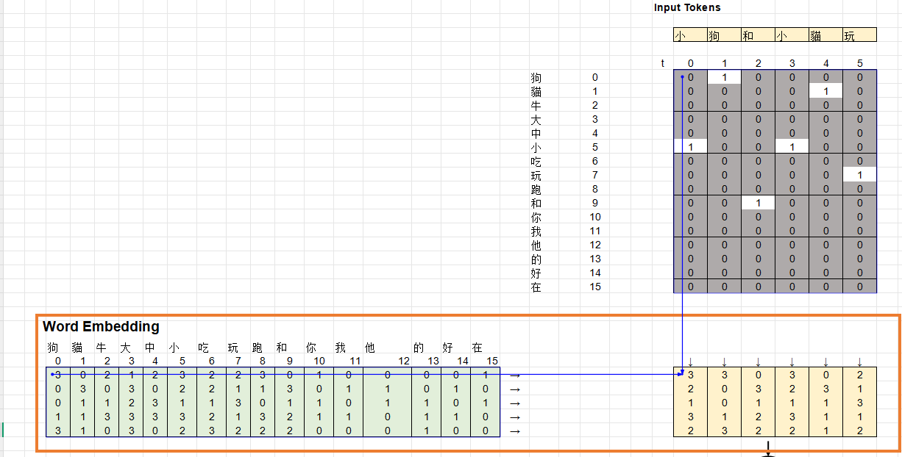

### 嵌入和词表

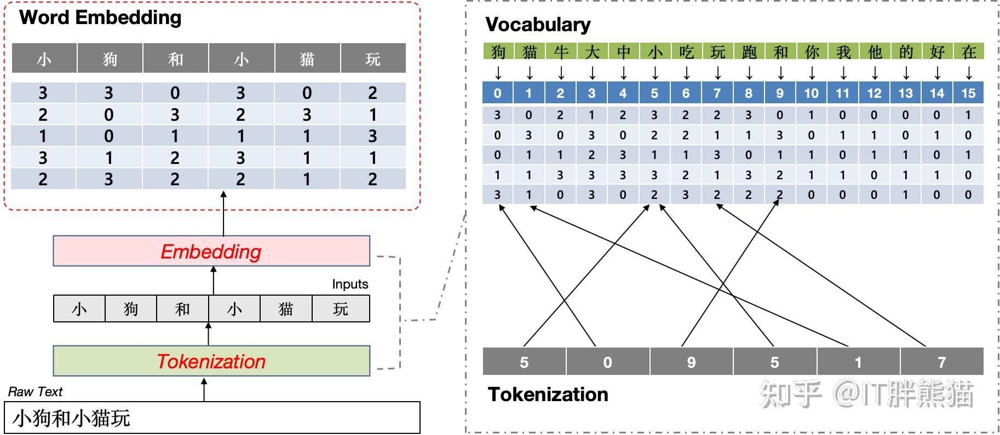

## 2.Positional Encoding

注意力机制是不考虑Token位置的，这个就很可怕了，主语宾语都不分的话，那肯定无法正确理解意思的，每个词的位置信息也是很重要的，但是需要保证每个位置的PE编码不一样就行。

PE 的值可以直接按照位置顺序给到，当然也可以使用某种公式计算。
Transformer 中采用了后者，即便是用公式，位置向量也有多种表示方式，其中一种常见的是**正弦 - 余弦位置编码（Sinusoidal Position
Encoding）**

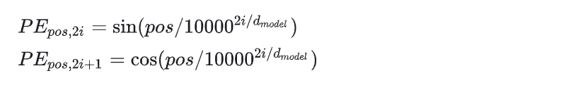

**X = Word Embedding + PE**

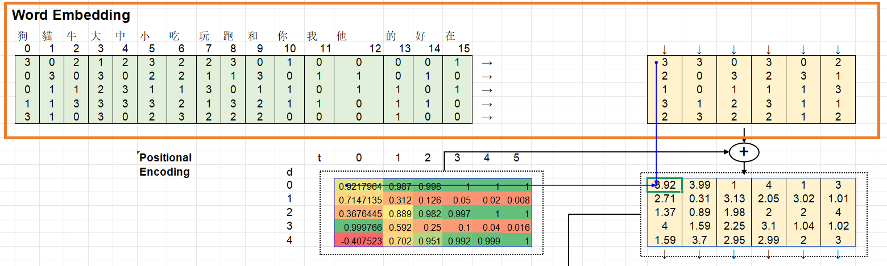

## 3.Multi-Head Attention

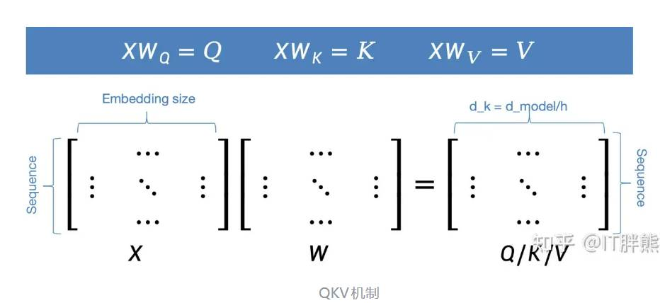

Query（查询）：代表当前关注的位置（如当前处理的单词）。  
Key（键）：代表序列中所有位置的标识，用于与 Query 匹配相似性。  
Value（值）：存储实际的信息，通过注意力权重加权后生成最终输出

```
举个具体例子：
- 假设用户输入一句话：“苹果 多少钱 一斤”？

当模型处理到 “钱” 这个字时：“钱” 产生的 Query (Q) 就会在整句话里扫射。
它扫到 “一斤” 和 “苹果” 的 Key (K) 时，发现匹配度极高（因为钱和商品、单位强相关）；
扫到其他无关词时匹配度很低。

于是，“钱” 就会把 “苹果” 和 “一斤” 的 Value (V) 深度吸收进来。
这样模型就能精准理解：这里的“钱”不是指年终奖，也不是指硬币，而是指水果的零售价格。
```

**参数**

- Sequence：输入序列的 Token 数量。
- Embedding size：模型的基准维度 (d_{model})
- h：多头注意力机制中的总头数
- d_{k}：单个注意力头的维度。每个头的维度由 d_k = d_{model} / h 决定

**矩阵维度拆解(X、W、Q/K/V)**

- X（输入矩阵）：维度为 Sequence X Embedding size。它代表（序列长度 X 词向量维度 (d_{model})）。
- (W)（权重矩阵）：维度为 Embedding size X (d_{k})。它是模型需要学习的参数。
- (Q/K/V)（输出矩阵）：维度为 Sequence X (d_{k})。它是降维后的注意力矩阵。

**核心公式**

- (XW_Q = Q)（生成查询矩阵）
- (XW_K = K)（生成键矩阵）
- (XW_V = V)（生成值矩阵

示例：Q计算
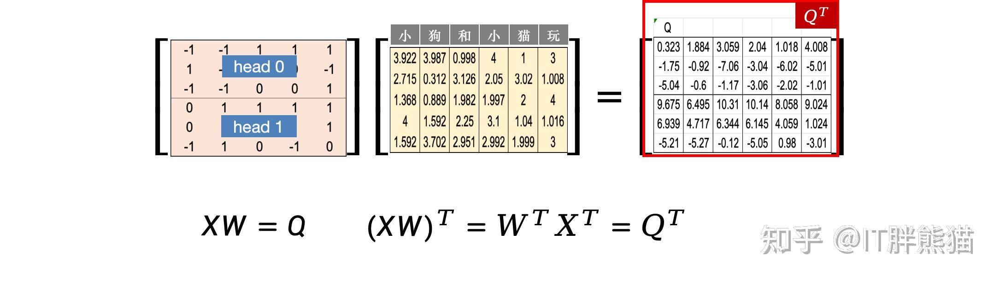

**缩放点积注意力机制（Scaled Dot-Product Attention）**
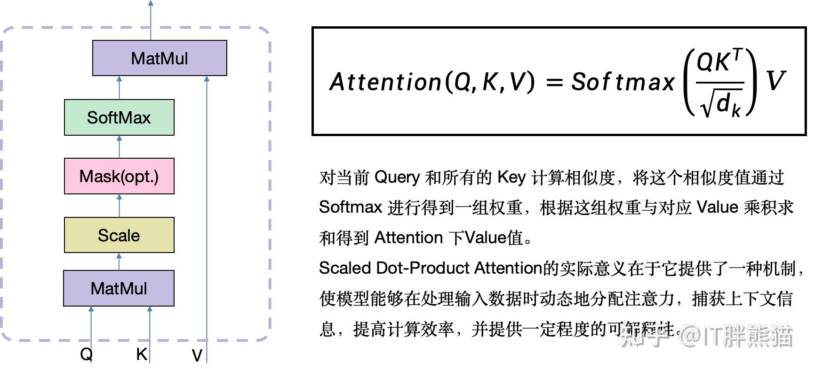

Q、K、V的计算过程，`AI By Hand` 中做了转置
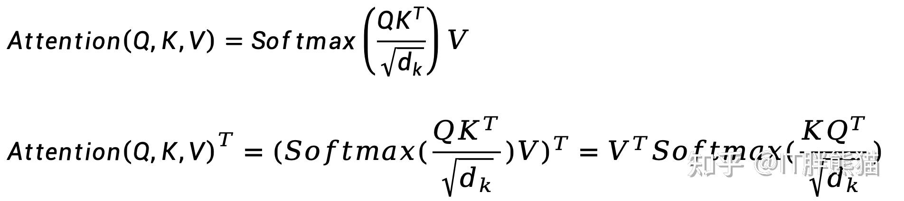

示例：Head 0计算
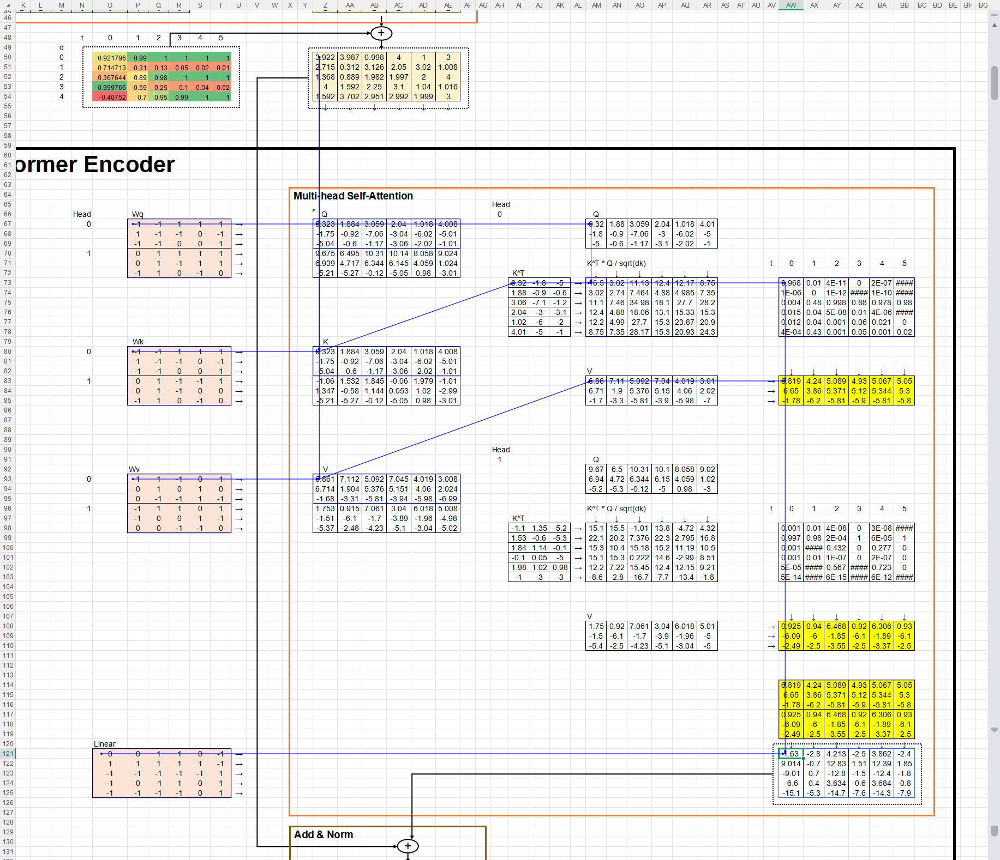

同理可以计算 Head 1，得到结果拼接后做多头注意力
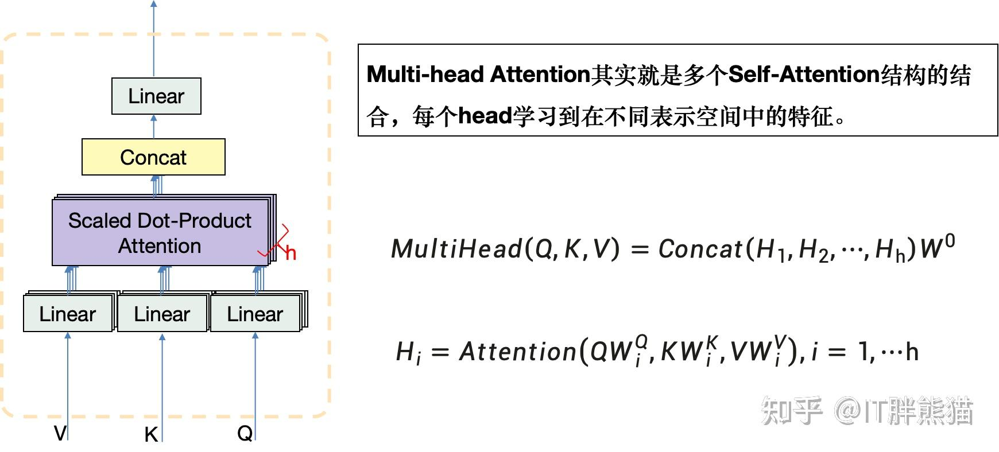

## 4.Add&Norm

**Add，残差连接**，是一种在深度神经网络中非常常用的技术，将输入直接传递到输出，与经过网络层变换后的结果相加，目的就是让多层的神经网络也能感受到最初的输入。

残差连接（Residual Connection）最早由何恺明等人在2015年提出的ResNet（残差网络）中引入。
它的核心思想是通过引入“跳跃连接”（Skip Connection），从而缓解深度网络中的梯度消失或爆炸问题。

**Norm，层归一化。**
Z-Score Normalization：将数据转换为均值为0、标准差为1的分布

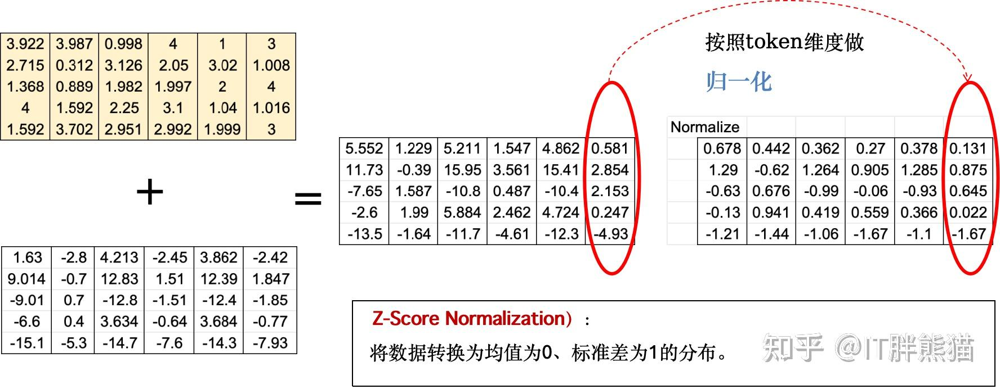

另外在Add & Norm层中还有个操作，叫做**Scaled & shift（缩放和偏移）**，其核心作用是对输入数据进行标准化处理，以提高模型的稳定性和训练效率。
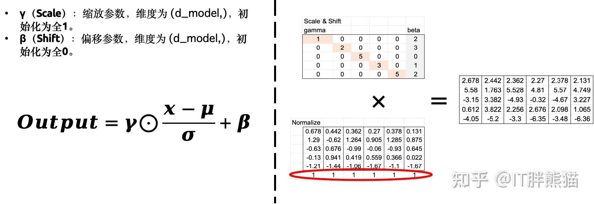

## 5.Feed Forward Neutral Network

- 第一层全连接：将输入升维到 4×d_{model} ，这里放大2 倍。
- ReLU：引入非线性，过滤负值。
- 第二层全连接：降维回 d_{model}

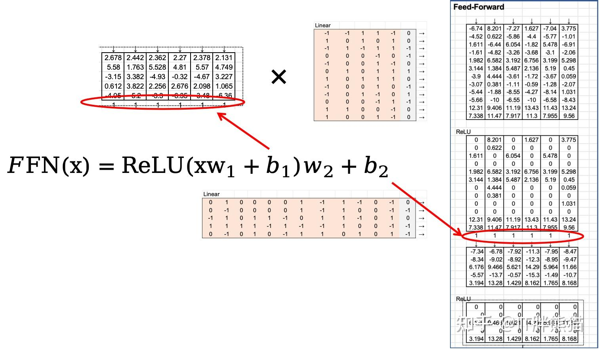

## 6.Masked Multi-Head Attention

Decoder部分和Encoder非常相似，可以看到除了前面的Masked MHA以外，和Encoder一模一样的，
所以 **Decoder = Masked MHA + Encoder**

## 7.Liner

## 8.Softmax

# Deepseek架构（AI By Hand）

在Transformer基础上，引入以下特性

- MLA(多头潜在注意力)
    - RoPE：压缩，降维

- Mixture Of Experts(混合专家模型)
    - Router
        - shared
        - routed
    - expert(先升维再降维)
        - bias 用于改变每一行的值（加/减）
        - ReLU 修正负数
        - Gates 每个专家的权重或者选择概率，用于改变每一列的值（乘/除）

# Decoder-Only 架构

# 大模型交互

## 提示词

* temperature: 越小越准确，越大越发散
* top_k: 将所有 token 按概率从高到低排序，取排名前 k 个的 token 组成 “候选集”，随后对筛选出的 k 个 token 的概率进行 “归一化”。
* top_p（probability）: 将所有 token 按概率从高到低排序，从排序后的第一个 token 开始，逐步累加概率，直到累积和首次达到或超过阈值
  p。
* 零样本、单样本、少样本提示
* 角色扮演、上下文示例
* COT

## 文本分词

* 字节对编码BPE
  

# 大模型局限性

* 事实性幻觉
* 忠实性幻觉
* 内在幻觉（生成的内容与输入直接矛盾）

# 模型选择

* 性能与能力（不同的模型擅长的任务不同）
* 速度（延迟）
* 成本
* 上下文窗口
* 部署方式
* 生态与工具链
* 可微调与定制化
* 安全行与伦理
