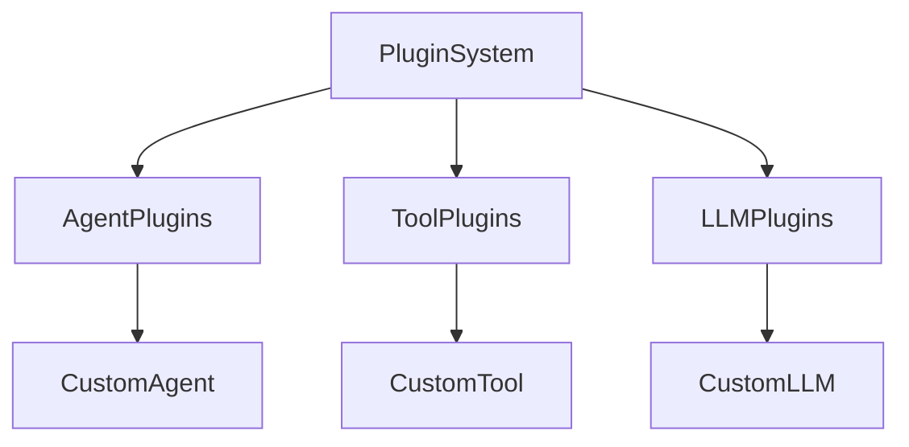

# 第七章习题解答

# TODO-QIU: 2026年2月2日, 星期一 
## 1. HelloAgents框架分析

### 1.1 主流框架局限性分析
- **过度抽象的复杂性**：如LangChain中，简单任务需要理解Chain、Agent、Tool等多个概念，学习曲线陡峭
- **快速迭代带来的不稳定性**：API频繁变更，导致已有代码无法运行
- **黑盒化的实现逻辑**：难以理解内部工作机制，遇到问题时依赖文档和社区
- **依赖关系的复杂性**：大量依赖包可能导致冲突问题

在实际项目中，这些局限性对开发效率的影响体现在：

1. **学习成本高**：在LangChain中，即使是简单的对话机器人也需要理解大量的抽象概念（如LLM、ChatModel、PromptTemplate、Chain等），新手需要花费大量时间理解各组件之间的关系。

2. **维护困难**：框架快速迭代导致API变更频繁，如从LangChain 0.0.x版本到0.1.x版本，很多接口发生了变化，需要大量重构工作。

3. **调试困难**：当出现问题时，由于框架的黑盒性质，很难追踪到具体的问题所在，尤其是在复杂Chain中。

4. **依赖管理复杂**：框架通常携带大量依赖，容易与其他项目依赖冲突，增加了环境配置的复杂度。

### 1.2 "万物皆为工具"设计理念
**优势：**
- 统一抽象，简化架构设计
- 易于扩展和维护
- 降低学习成本

**局限性：**
- 某些复杂功能（如Memory）可能不适合简单工具抽象
- 可能损失特定模块的优化空间

### 1.3 框架化改进
- **统一接口**：所有Agent继承[Agent](file://C:\VsCode\llm\hello-agents\Co-creation-projects\YYHDBL-HelloCodeAgentCli\core\agent.py#L11-L52)基类
- **标准化配置**：使用[Config](file://C:\VsCode\llm\hello-agents\Co-creation-projects\YYHDBL-HelloCodeAgentCli\core\config.py#L10-L140)类统一管理
- **工具系统集成**：通过[ToolRegistry](file://C:\VsCode\llm\hello-agents\Co-creation-projects\YYHDBL-HelloCodeAgentCli\tools\registry.py#L7-L220)管理工具

## 2. HelloAgentsLLM扩展

### 2.1 添加新模型供应商支持
```python
class GeminiLLM(HelloAgentsLLM):
    def __init__(self, model: Optional[str] = None, api_key: Optional[str] = None, **kwargs):
        if provider == "gemini":
            self.provider = "gemini"
            self.api_key = api_key or os.getenv("GEMINI_API_KEY")
            self.base_url = "https://generativelanguage.googleapis.com/v1beta/"
            # 配置Gemini特定参数
        else:
            super().__init__(model=model, api_key=api_key, provider=provider, **kwargs)
```

### 2.2 自动检测机制分析
当同时设置`OPENAI_API_KEY`和`LLM_BASE_URL="http://localhost:11434/v1"`时，框架会选择**OpenAI**，因为环境变量检测优先级高于URL检测。

### 2.3 本地模型部署方案对比
- **VLLM**：高性能，适合高并发场景，但配置复杂
- **Ollama**：易用性好，一键部署，适合快速原型
- **SGLang**：平衡性能和易用性，支持更多模型格式

## 3. 框架核心组件分析

### 3.1 Pydantic优势
- 数据验证和序列化
- 类型安全
- 自动生成文档

### 3.2 抽象方法设计
使用**模板方法模式**，[run](file://C:\VsCode\llm\hello-agents\code\chapter4\ReAct.py#L32-L71)为公共接口，`_execute`为子类必须实现的方法，确保一致性。

### 3.3 配置管理
**单例模式**确保全局配置一致性，避免多实例导致的配置冲突。

## 4. Agent范式框架化实现

### 4.1 ReActAgent改进点
1. **统一接口**：继承[Agent](file://C:\VsCode\llm\hello-agents\Co-creation-projects\YYHDBL-HelloCodeAgentCli\core\agent.py#L11-L52)基类，标准化API
2. **工具注册**：使用[ToolRegistry](file://C:\VsCode\llm\hello-agents\Co-creation-projects\YYHDBL-HelloCodeAgentCli\tools\registry.py#L7-L220)统一管理
3. **配置中心化**：使用[Config](file://C:\VsCode\llm\hello-agents\Co-creation-projects\YYHDBL-HelloCodeAgentCli\core\config.py#L10-L140)类管理参数

### 4.2 质量评分机制
```python
def run_with_quality_check(self, input_text: str, quality_threshold: float = 0.8):
    current_content = self.initial_agent.run(input_text)
    
    for iteration in range(self.max_iterations):
        # 获取质量评分
        quality_score = self._evaluate_quality(current_content, input_text)
        
        if quality_score >= quality_threshold:
            break
            
        feedback = self.reflection_agent.run({
            "task": input_text,
            "content": current_content
        })
        
        current_content = self.refinement_agent.run({
            "task": input_text,
            "last_attempt": current_content,
            "feedback": feedback
        })
    
    return current_content
```

## 5. 工具系统设计

### 5.1 统一接口的重要性
强制统一接口确保：
- 工具可互换性
- 框架可预测性
- 降低集成复杂度

**多值返回设计：**
```python
class SearchResult(BaseModel):
    title: str
    summary: str
    url: str

def execute(self, params: dict) -> SearchResult:
    # 返回结构化数据
    return SearchResult(title=title, summary=summary, url=url)
```

### 5.2 工具链应用场景
**场景：新闻聚合分析**
- 工具1：`news_search` - 搜索最新新闻
- 工具2：`summarize` - 总结新闻要点
- 工具3：`translate` - 翻译为中文

### 5.3 异步执行优势
当工具间无依赖关系且I/O密集型操作时，并行执行能显著提升性能。

## 6. 框架扩展设计

### 6.1 流式输出功能
```python
def stream_run(self, input_text: str) -> Iterator[str]:
    messages = self._build_messages(input_text)
    
    for chunk in self.llm.stream_invoke(messages):
        yield chunk
        # 实时更新历史记录
        self.add_message(Message(chunk, "assistant"))
```

### 6.2 多轮对话管理
新增`ConversationManager`类：
- 管理对话分支
- 支持回溯功能
- 与[Message](file://C:\VsCode\llm\hello-agents\Co-creation-projects\YYHDBL-HelloCodeAgentCli\core\message.py#L11-L35)系统集成

### 6.3 插件系统架构


**关键接口：**
- `PluginInterface`：插件基类
- `PluginManager`：插件管理器
- `register_plugin`：插件注册装饰器